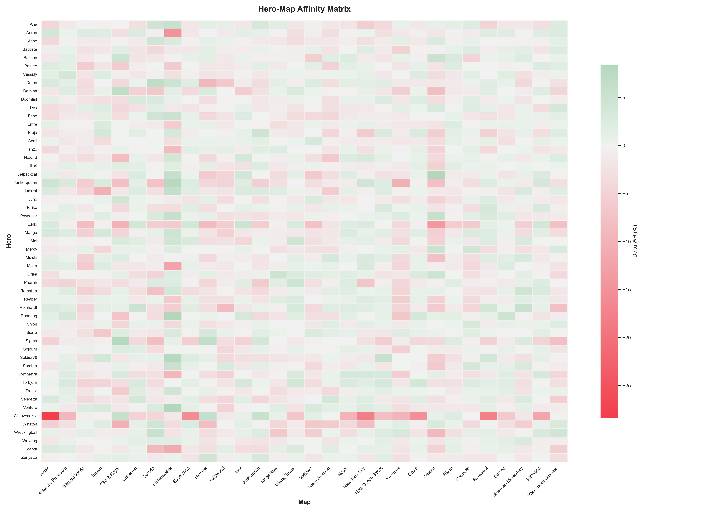
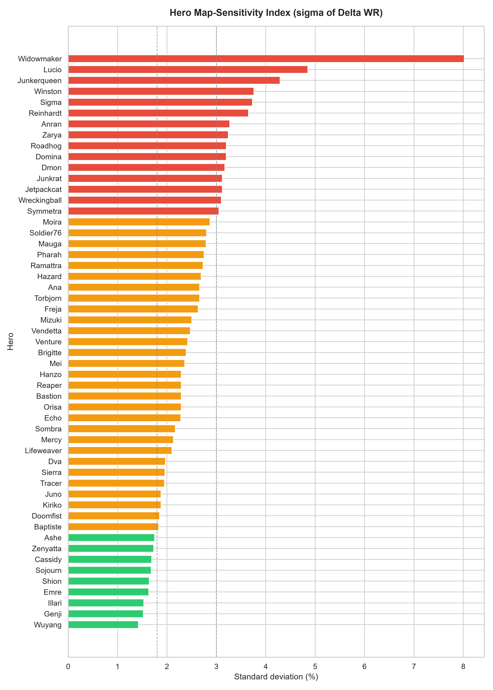
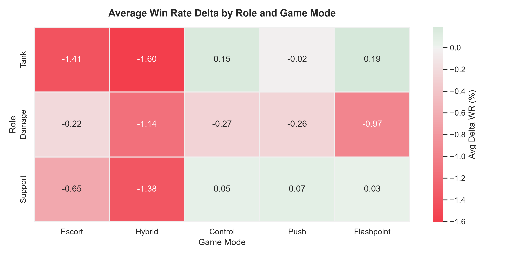
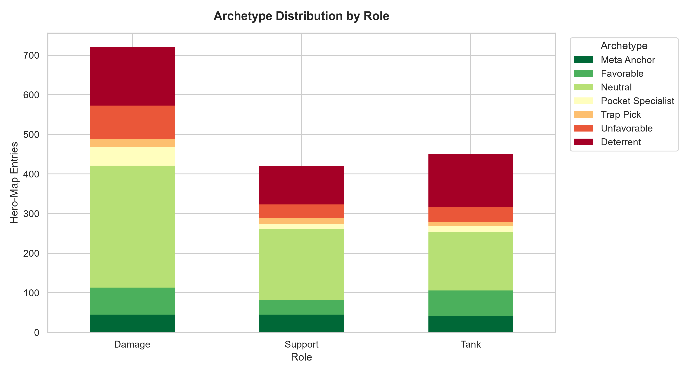
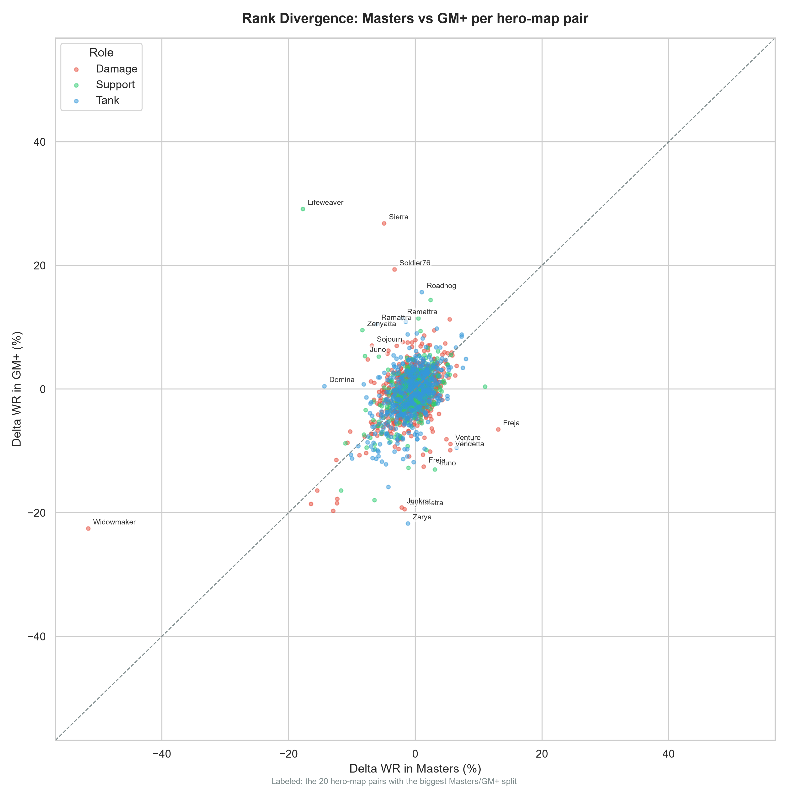

# Overwatch Map Affinity

Everybody knows that Overwatch heroes vary with their performance based on each map, and most can even name those cases, such as Winston being good at Watchpoint: Gibraltar. But still I wanted to see the extent of the map effect, and make a deep dive to find how each hero is effected by map changes. So, I pulled ranked win rate data and built something that answers it properly: for every hero, on every map, how much does their win rate move relative to their own average?

I didn't want to make a system that was dependant on patches, but rather wanted to find values that would stay the same regardless of hero's current balance or meta status, so I used "delta win rate" (map win rate minus the hero's baseline win rate for the same rank/region/patch slice). Of course this data is only valuable without any hero or map reworks, in those cases the data needs refreshing. But these values in this research should, in theory, survive regular balance changes.

**[Live data browser →](web/index.html)** (needs a local server, see below)



## What's in here

- **`analysis/`** — the actual pipeline: pull data from the OWTics API, compute deltas, spit out a dataset and a markdown report.
- **`data/`** — the processed output. `web_data.json` feeds the site, `csv/` and `final_affinities.json` are for anyone who wants to have fun with it themsleves in a spreadsheet or notebook.
- **`report/analysis_report.md`** — the full tier list, map by map, generated straight from the data.
- **`charts/`** — the visuals below, regenerable with one command.
- **`web/`** — a small dashboard: filter by rank/region, look up a map or a hero, build a pool of your mains and export an offline cheat sheet.

## The numbers

- **Delta WR** — a hero's win rate on a map minus their baseline win rate in that same rank/region/patch slice, averaged across every slice I collected (currently seasons 1-4 (2026, no season 4 midseason), Masters and up). Tiers: S ≥ +3.0%, A +1.2 to +2.9%, B ±1.1%, C −1.3 to −3.0%, D < −3.0%.
- **Delta PR** — pick rate lift on the map vs. the hero's average pick rate. Tells you whether a strong map is being drafted for, or slept on.
- **Archetype** — a rough read of delta WR crossed with delta PR: *Meta* (strong and popular), *Specialist* (strong but rarely picked), *Trap Pick* (weak but still picked a lot), *Deterrent* (weak and avoided).
- **Sigma (map sensitivity)** — standard deviation of a hero's delta across all maps. High sigma = map specialist, low sigma = plays about the same everywhere.
- **Rank divergence** — flags heroes whose delta shifts by 2.5%+ between Masters and GM/Champion, helpful in some edge cases where the disparity between Masters and GM+ can be big enough to be misleading.

More charts, for the curious:

| | |
|---|---|
|  |  |
|  |  |

## Running the site

The dashboard is static, it just fetches `data/web_data.json`. Browsers block that fetch over `file://`, so serve it from a folder:

```bash
python -m http.server 8000
```

Then open `http://localhost:8000/web/index.html`.

## Regenerating the data

The processed data in `data/` is already checked in, so the site and report work without doing anything else. If you want to pull fresh numbers:

```bash
pip install -r requirements.txt
```

1. `analysis/harvest.py` scrapes OWTics' GraphQL API into `data/raw/`. It needs a `cf_clearance` cookie from a real browser session (OWTics sits behind Cloudflare) — grab one from devtools and export it:
   ```bash
   export OWTICS_CF_CLEARANCE="your cookie value"
   python analysis/harvest.py
   ```
2. `analysis/build_dataset.py` turns the raw cache into `data/web_data.json`.
3. `analysis/report.py` writes `report/analysis_report.md` and the CSVs in `data/csv/`.
4. `analysis/charts.py` regenerates everything in `charts/` from the processed data.

Raw per-hero cache files aren't checked in (they're big and easy to regenerate), so `data/raw/` is gitignored.

## Caveats

Heroes and maps added (or reworked) mid-timeframe are only counted from the season they existed in, and reworked maps only count data from after the rework.
